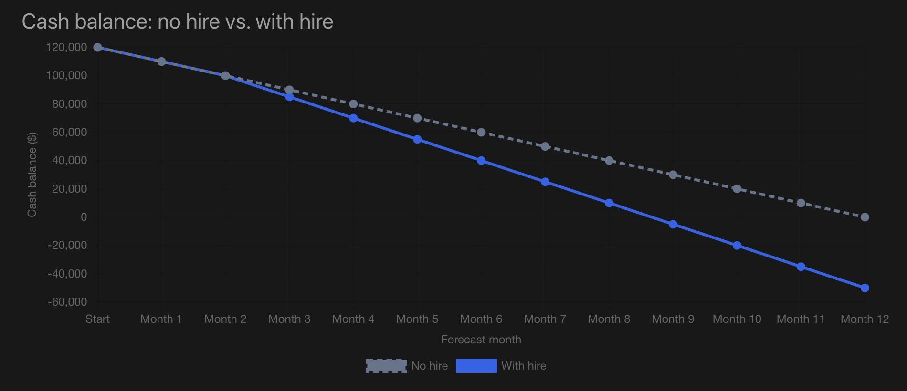

# Startup Runway Simulator

**Explore how a hiring decision changes a startup’s cash runway.**

An interactive Vue dashboard that compares a no-hire baseline with a planned hire over 12 months. Adjust the starting cash, monthly receipts, existing expenses, and hiring date to see the effect on cash balances and the projected cash-out month.



## What it does

- **Compare scenarios:** view no-hire and with-hire forecasts on the same interactive chart.
- **Model a planned hire:** choose the total monthly employee cost and start month.
- **Understand the impact:** compare projected cash-out points, month-12 balances, and additional expenses.
- **Inspect the calculations:** follow opening cash, receipts, expenses, and closing cash in a monthly table.

Built with **Vue 3, JavaScript, Vite, Chart.js, and vue-chartjs**. Calculations run in the browser. Inputs reset when the page is refreshed.

## Run locally

Install Node.js matching the range in `package.json`: **22.18+ within version 22, or 24.12+**.

```sh
git clone https://github.com/LouisGou/startup-runway-simulator.git
cd startup-runway-simulator
npm ci
npm run dev
```

Open the local address printed in the terminal.

| Command           | Purpose                                   |
| ----------------- | ----------------------------------------- |
| `npm run dev`     | Start the development server              |
| `npm run build`   | Create the production files in `dist/`    |
| `npm run preview` | Preview the production build locally      |
| `npm run lint`    | Run the linters and apply automatic fixes |
| `npm run format`  | Format the source files                   |

## Try this example

Start with **$120,000** in cash, **$10,000** in monthly receipts, and **$20,000** in existing monthly expenses. Add an employee costing **$5,000 per month**, starting in **month 3**.

| Result                    | No hire         | With hire      |
| ------------------------- | --------------- | -------------- |
| Cash-out point            | End of month 12 | During month 9 |
| Cash at month 12          | $0              | −$50,000       |
| Additional hiring expense | $0              | $50,000        |

With cash flowing evenly during each month, hiring reduces estimated runway from **12 months to approximately 8.67 months**—a reduction of **3.33 months**.

## How the forecast works

```text
Closing cash = Opening cash + Cash received − Cash paid
Next month’s opening cash = This month’s closing cash
```

The model makes these assumptions:

- Monthly receipts and existing expenses stay constant.
- The full hiring cost is added every month from the selected start month, including that month. Include benefits and other employer costs in this input.
- Hiring changes expenses only; it does not automatically increase sales.
- Money comes in and goes out evenly within each month. Fractional runway is interpolated using that month’s net cash burn.
- All inputs use one currency. The dollar symbol is a display convention, with no currency conversion.
- A negative balance represents the funding gap if spending continues; the model does not automatically raise or borrow money.

**The forecast covers 12 months.** A positive balance at the end means cash lasts beyond the displayed period; it does not imply unlimited runway. This version does not separately model growth, delayed payments, financing, taxes, or one-time expenses.

## Project structure

```text
src/
  App.vue                       Inputs, forecast calculations, summaries, and table
  components/CashFlowChart.vue   Interactive comparison chart
  assets/                       Shared styles
  main.js                       App entry point
public/favicon.svg              App icon
docs/preview.jpg                Dashboard preview
```
